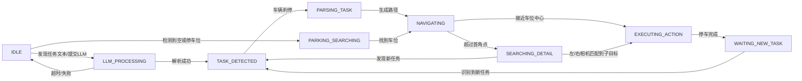
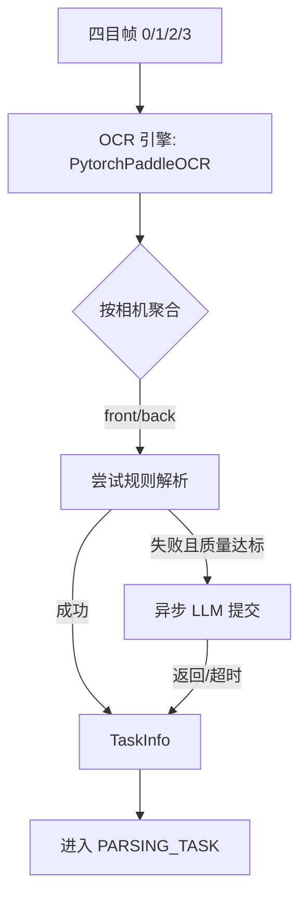
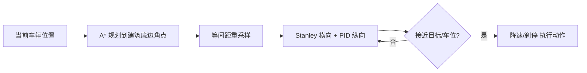

### VLA 自动驾驶系统（四目相机 + OCR + 导航）

本项目实现了基于 Vision-Language-Action（VLA）的自动驾驶任务执行框架，结合四目相机 OCR 识别、任务解析（含本地 LLM/Ollama 兜底）、A* 路径规划与 Stanley+PID 路径跟踪，实现“识别路边文字任务牌→解析任务→生成路径→到达/停车”的端到端流程。项目内置可视化 GUI、路径导出与日志记录，便于调试与二次开发。

---

## 功能总览

- 四目相机 OCR：统一抽象 `VLACameraOCRSystem`，按前/右/左/后相机返回结构化识别结果（含文本、置信度、位置中心、帧尺寸）。
- 任务解析（OCRProcessor）：
  - 规则解析：多种时间/地点/动作正则模板与 OCR 混淆纠错；
  - LLM 解析：支持本地 Ollama（默认 `qwen3:0.6b`），异步处理、超时兜底、相似文本去重；
  - 方向后处理：支持“X建筑东/西/南/北侧”相对方位锚定并选择最合理目标建筑。
- 路径规划与跟踪：
  - A* 规划（`PathPlanner`）：地图边界与旋转建筑体积碰撞检测，等间距重采样；
  - 导航控制（`NavigationController`）：Stanley 横向 + PID 纵向，动态前视距离与目标车速自适应；
  - 停车流程：基于 ParkingFinder，支持“限时/限速内寻找空车位→两段目标点+重采样路径→刹停”。
- VLA 状态机（`VLATaskController`）：`IDLE → LLM_PROCESSING → TASK_DETECTED → PARSING_TASK → NAVIGATING → SEARCHING_DETAIL / PARKING_SEARCHING → EXECUTING_ACTION → WAITING_NEW_TASK`。
- 可视化与调试：
  - GUI（tkinter 多进程）：轨迹、道路、建筑与相机画面；
  - 导航路径导出 `navigation_path.png`；
  - OCR 调试图保存；
  - 周期性日志与状态打印。

---

## 目录结构

```text
├─ main.py                         # 主入口：四目相机 + OCR + VLA 状态机 + 可选 GUI
├─ main_park.py                    # 简化停车端到端演示（跳过 OCR/LLM）
├─ main_pid_traj.py               # 固定任务导航 + PID/Stanley 调参与轨迹展示
├─ vla_task_controller.py          # VLA 状态机：任务识别/解析/导航/停车全流程
├─ controllers.py                  # 基础控制算法（PID）
├─ navigation_controller.py        # Stanley + PID 组合导航控制
├─ path_planner.py                 # A* 路径规划与碰撞检测/重采样
├─ parking_finder.py               # 停车搜索器（与 OCR 结果协同）
├─ ocr_paddle.py                   # OCR 引擎封装与四目集成（PytorchPaddleOCR）
├─ ocr_processor.py                # 规则解析版 OCR 文本处理
├─ ocr_processor_llm.py            # LLM（Ollama）解析版
├─ ocr_processor_llm2.py           # LLM 异步 + 质量评估 + 去重 + 方向增强版
├─ gui.py / gui_frame_traj.py      # 两种 GUI 实现（后者含路径显示与相机帧）
├─ infer/                          # OCR 推理子模块（det/rec/cls 与工具）
├─ pytorchocr/                     # Pytorch-PaddleOCR 实现与网络定义
├─ utils/                          # OCR 可视化与文本框后处理工具
├─ config/arch_config.yaml         # OCR 架构映射配置
└─ models/                         # OCR 模型与词典
```

---

## 安装与运行

### 环境依赖

- Python 3.9+
- PyTorch（匹配本机 CUDA/CPU）
- 其它常用库：numpy、opencv-python、Pillow、requests、matplotlib、scipy、tqdm、omegaconf、pyyaml、keyboard、tkinter（自带）

模型文件放置：
- `models/ptocr_v5_mobile_det.pth`
- `models/ptocr_v5_mobile_rec.pth`
- 字典：`models/ppocrv5_dict.txt`（或使用 `pytorchocr/utils/ppocr_keys_v1.txt`）

### 启动主程序（四目相机 + OCR + VLA）

```bash
python main.py
```

常用快捷键：
- C：切换手动/自动；V：打印 VLA 状态；O：保存 OCR 调试图；
- 空格：重试关卡；N：跳关；
- R/F/T/G：档位切换（倒/前/空/驻）。

### 仅停车端到端演示（跳过 OCR/LLM）

```bash
python main_park.py
```

### 固定目标导航 + 控制调参

```bash
python main_pid_traj.py
```

---

## 模块详解与数据流

### 1) 主循环与四目 OCR（`main.py` + `ocr_paddle.py`）

流程：连接仿真 → 拉取四目帧 → 按策略触发 OCR → 将相机分组结果交给任务控制器。

识别结果结构（简化）：

```text
{ camera_id: CameraOCRResult }
CameraOCRResult: { camera_id, detected_text[], text_detections[], frame_shape }
text_detections: [{ text, confidence, bbox[[x,y]*4], center(x,y) }]
```

引擎特性：
- 一次加载模型常驻；
- 支持相邻行无缝合并（可关闭）；
- 可视化接口 `visualize_ocr_result` 输出带中英文的叠加图。

### 2) 任务解析与 LLM 异步（`vla_task_controller.py` + `ocr_processor_llm2.py`）

- 在 `IDLE/WAITING_NEW_TASK` 状态，优先用前/后相机文本尝试快速规则解析；
- 若规则失败且质量评分达标，异步提交 Ollama，`LLM_PROCESSING` 期间车辆刹停等待；
- 成功得到 `TaskInfo` 后，切入 `PARSING_TASK`，生成 VLA 文本输出与导航路径。

TaskInfo 关键字段：`time_limit, destination, sub_destination, action, direction`。

停车直达触发：若任意检测文本含“停车位/空”，直接进入 `PARKING_SEARCHING`（限速/限时由文本自动解析提取）。

### 3) 路径规划与跟踪（`path_planner.py` + `navigation_controller.py`）

- A* 搜索：考虑旋转建筑包围盒与安全边距；必要时保存失败调试图 `astar_debug_failed.png`；
- 进入导航前可插入“远离最近建筑外框”的预偏置点，避免贴边开局转弯困难；
- 重采样为等间距路径点 → Stanley 横向控制 + PID 速度控制；
- 逼近车位或终点自动降速，接近车位中心则切入 `EXECUTING_ACTION` 刹停。

### 4) GUI 可视化（`gui.py` / `gui_frame_traj.py`）

- 多进程 tkinter：道路、建筑、轨迹、导航路径（虚线）与相机帧；
- 通过 `Dashboard.update(msg, nav_path)` 与 `update_frame(frame)` 更新显示。

---

## 关键流程图

### 总体状态机



### 四目 OCR 与任务解析



### 路径规划与跟踪



---

## 配置与可调参数

- `main.py` 顶部：`USE_GUI`、`USE_REAL_OCR`、`OCR_FREQUENCY`；
- `NavigationController`：`stanley_k`、`path_spacing`、速度 PID（`kp/ki/kd`）；
- `PathPlanner`：`grid_size`、`safety_margin`、地图边界；
- `ocr_paddle.py`：最小置信度、相邻行合并开关；
- `ocr_processor_llm2.py`：Ollama 模型名、URL、最小请求间隔、质量评估阈值与异步超时；
- `main_pid_traj.py`：统一集中调参。

---

## 常见问题和处理

- OCR 太慢/显存不足：
  - 降低 `OCR_FREQUENCY`，或仅在 `should_run_ocr` 返回 True 时调用；
  - 使用 CPU 推理或更小模型；
  - 关闭行合并与可视化。
- LLM 无响应：
  - 确保 `http://localhost:11434` 服务正常；
  - 调低超时或回退规则解析（已内置兜底）。
- 路径规划失败：
  - 查看 `astar_debug_failed.png`；
  - 调整安全边距/网格间距或启用预偏置点。